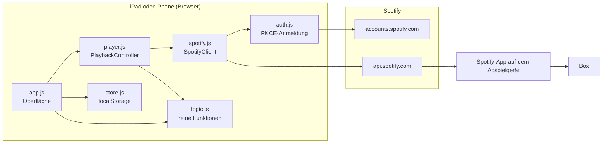

# Architektur Handball Launchpad

## Ziel und Randbedingungen

Ziel ist ein Launchpad, das unter Spielstress mit einem Tipp den passenden Musikausschnitt startet und mit einem zweiten Tipp beendet. Randbedingungen des Prototyps:

- Bedienung auf iPad und iPhone, kein Mac und kein Apple-Entwicklerkonto nötig
- Musikquelle Spotify (Premium), Test vor einer möglichen Umstellung auf eigene Dateien
- Keine externen Bibliotheken, keine Build-Kette, reine ES-Module
- Belegung und Anmeldung bleiben auf dem Gerät

## Überblick

Das Launchpad ist eine reine Web-App. Sie spielt selbst keinen Ton ab, sondern steuert über die Spotify Web API ein Spotify-Gerät (iPad, iPhone oder Laptop mit der Spotify-App). Der Ton läuft vom Abspielgerät zur Box.



## Komponenten

| Modul | Verantwortung | Abhängig von |
|---|---|---|
| `config.js` | Konstanten (Endpunkte, Scopes, Zeiten) | nichts |
| `logic.js` | Reine Funktionen: Link-Erkennung, Zeitformate, Rotation, Fade-Kurve, Validierung | nichts |
| `defaultBoard.js` | Vorbelegung der Kategorien und Clips | nichts |
| `auth.js` | Anmeldung per Authorization Code mit PKCE, Token-Erneuerung | `config.js`, Browser |
| `spotify.js` | HTTP-Zugriff auf die Player-Endpunkte, serielle Befehlsschlange, Fehlerübersetzung | `config.js`, Auth-Objekt |
| `player.js` | Zustand des laufenden Clips, Start, Ausblenden, Auto-Stopp, Abbruchlogik | Client-Schnittstelle, `logic.js` |
| `store.js` | Persistenz, Import und Export | `logic.js`, `defaultBoard.js` |
| `app.js` | Darstellung, Bedienung, Editor, Gerätewahl | alle obigen |

Die Abhängigkeiten zeigen nur in eine Richtung. `logic.js` und `player.js` sind ohne Browser testbar.

## Ablauf: Tor-Taste zweimal tippen

```mermaid
sequenceDiagram
  actor T as Thorsten
  participant UI as app.js
  participant PC as PlaybackController
  participant SC as SpotifyClient
  participant API as Spotify Web API

  T->>UI: Tipp auf "Tor"
  UI->>UI: nächsten Clip der Rotation wählen
  UI->>PC: play("tor", clip)
  PC->>PC: neues token, Timer löschen
  opt Gerät erlaubt Lautstärke und Pegel weicht ab
    PC->>SC: setVolume(clip.volume)
    SC->>API: PUT /me/player/volume
  end
  PC->>SC: play(uris, position_ms)
  SC->>API: PUT /me/player/play
  PC->>PC: Auto-Stopp nach Dauer minus Ausblendzeit planen
  T->>UI: zweiter Tipp
  UI->>PC: stop(fade)
  alt Lautstärke steuerbar
    loop 6 Schritte, solange token aktuell
      PC->>SC: setVolume(Schritt)
      SC->>API: PUT /me/player/volume
    end
  end
  PC->>SC: pause
  SC->>API: PUT /me/player/pause
  PC->>SC: Lautstärke zurücksetzen (im Hintergrund)
```



## Datenmodell

Die Belegung ist ein JSON-Dokument und wird im localStorage gespeichert sowie als Datei exportiert.

```json
{
  "version": 1,
  "categories": [
    {
      "id": "tor",
      "name": "Tor",
      "clips": [
        {
          "id": "tor-maria",
          "title": "Maria (I Like It Loud)",
          "artist": "Scooter",
          "uri": "spotify:track:...",
          "startMs": 65000,
          "durationMs": 7000,
          "fadeMs": 1500,
          "volume": 100,
          "startVerified": false,
          "note": "Döp-döp-Stelle"
        }
      ]
    }
  ]
}
```

`durationMs` gleich 0 bedeutet: läuft bis zum manuellen Stopp. `uri` kann ein Track, eine Playlist oder ein Album sein. Die Kategorie-`id` bestimmt die Position im Raster (CSS `grid-area`). Unbekannte IDs werden automatisch angehängt.

Einstellungen (Gerät, Gesamtlautstärke, Rotationsstand) liegen getrennt unter `hlp.settings`, damit ein Import der Belegung sie nicht überschreibt.

## Architekturentscheidungen

**Web-App statt nativer iOS-App.** Kein Mac, kein Xcode, keine 99 Euro im Jahr, keine Installation nach sieben Tagen erneuern. Nachteil: Die App ist Fernbedienung und nicht selbst Player. Für einen Machbarkeitstest ist das der schnellste Weg.

**Spotify Web API statt App-Remote-SDK.** Das SDK gibt es nur für native Apps. Die Web API kann Songs mit Startposition starten (`position_ms`) und bei geeigneten Geräten die Lautstärke setzen. Ob ein Gerät das erlaubt, meldet Spotify im Feld `supports_volume`.

**Feature-Erkennung statt Annahme.** Das Ausblenden wird nur versucht, wenn das Gerät Lautstärkesteuerung meldet. Liefert Spotify trotzdem `VOLUME_CONTROL_DISALLOW`, schaltet der Controller für dieses Gerät dauerhaft auf harten Stopp um und meldet das einmal.

**Serielle Befehlsschlange.** Spotify garantiert keine Reihenfolge paralleler Player-Befehle. Alle Anfragen laufen deshalb nacheinander. Ein fehlgeschlagener Befehl blockiert die folgenden nicht.

**Abbruch per token.** Jede Aktion erhöht einen Zähler. Ausblenden, Auto-Stopp und Polling prüfen vor jedem Schritt, ob sie noch aktuell sind. Das verhindert den typischen Fehler, dass ein altes Ausblenden den neuen Tor-Clip nachträglich pausiert. Ein Test deckt genau diesen Fall ab.

**Leere Spotify-Links in der Vorbelegung.** Song-IDs werden nicht geraten, sondern im Editor aus Spotify übernommen. Unterschiedliche Versionen eines Songs haben unterschiedliche Zeiten, deshalb gehört die ID zur geprüften Version.

**Keine Abhängigkeiten.** Weniger Angriffsfläche, strenge Content-Security-Policy möglich, kein Build-Schritt, lange wartungsfrei.

## Fehlerbehandlung

| Situation | Verhalten |
|---|---|
| Access Token abgelaufen (401) | einmal erneuern und Anfrage wiederholen |
| Refresh Token ungültig (`invalid_grant`) | abmelden, Einrichtungsseite zeigen |
| Kein aktives Gerät (404) | verständliche Meldung, Geräteliste neu laden |
| Lautstärke nicht erlaubt (403) | harter Stopp, einmalige Meldung |
| Pause auf bereits pausiertem Gerät (403) | ignorieren |
| Zu viele Anfragen (429) | Meldung, erneut tippen |
| Keine Verbindung, Zeitüberschreitung (8 s) | Meldung, Zustand zurücksetzen |
| Song ohne feste Dauer endet in Spotify | Polling alle 10 Sekunden erkennt es und setzt die Taste zurück |

## Sicherheit und Datenschutz

- PKCE ohne Client Secret, `state` gegen untergeschobene Anmeldungen
- Nur zwei Scopes: Wiedergabezustand lesen und Wiedergabe steuern
- Content-Security-Policy erlaubt Verbindungen ausschließlich zu Spotify, keine fremden Skripte
- Nutzerinhalte werden nur als Text eingefügt, nie als HTML
- Tokens und Belegung liegen im localStorage des Geräts. Im Repository liegen keine persönlichen Daten.

## Erweiterungspunkte

**Eigene Audiodateien (LocalEngine).** Der `PlaybackController` spricht nur mit einem Objekt, das `play`, `pause`, `setVolume` und `getPlayback` anbietet. Eine lokale Engine auf Basis der Web Audio API (vorab dekodierte Puffer, ein Gain-Knoten pro Clip für echtes Ausblenden, Dateien im IndexedDB-Speicher) kann diese Schnittstelle bedienen. Oberfläche, Rotation, Editor und Tests bleiben. Das Datenmodell braucht dann zusätzlich eine Referenz auf die lokale Datei.

**Spieler-Torhymnen.** Eine weitere Kategorie mit Rückennummern als Chips. Technisch nichts Neues, eher eine Frage der Bedienung unter Zeitdruck.

**Offline-Start.** Ein Service Worker könnte die App-Dateien zwischenspeichern. Für Spotify bringt das wenig, weil die Steuerung ohnehin Internet braucht. Für die LocalEngine ist es wichtig.
